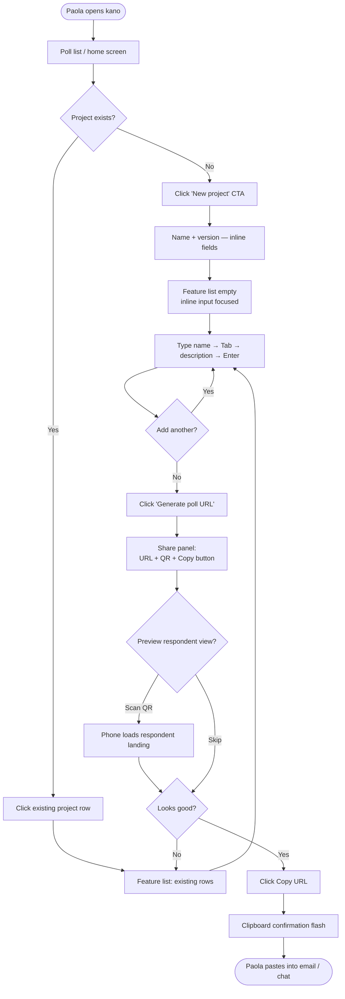
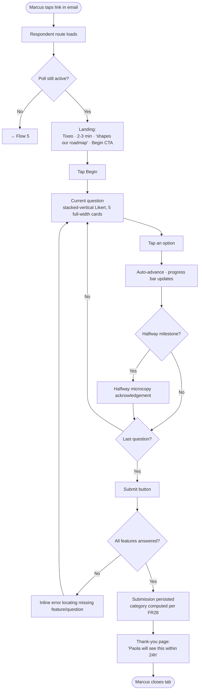
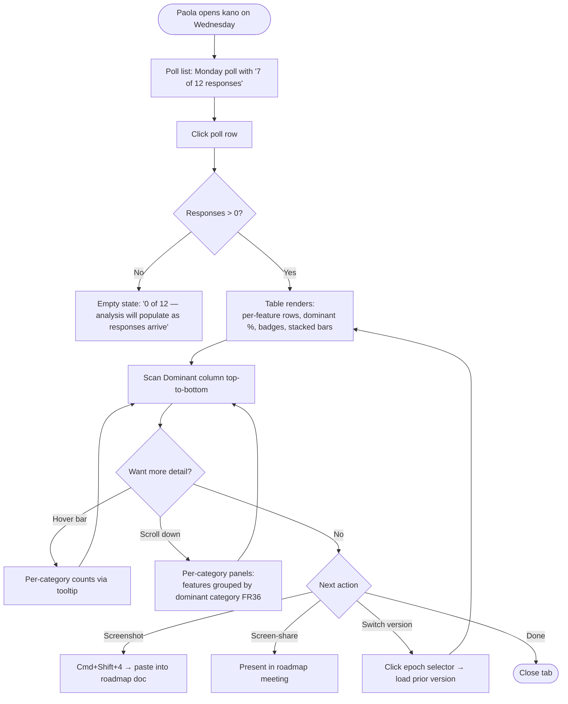
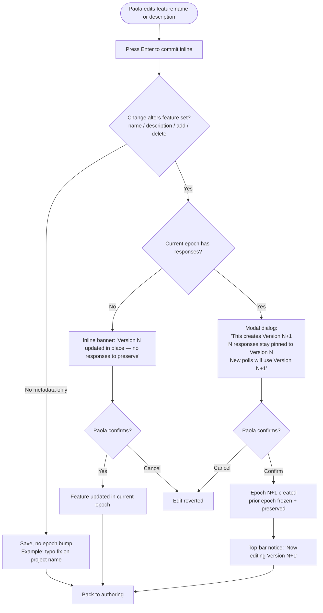
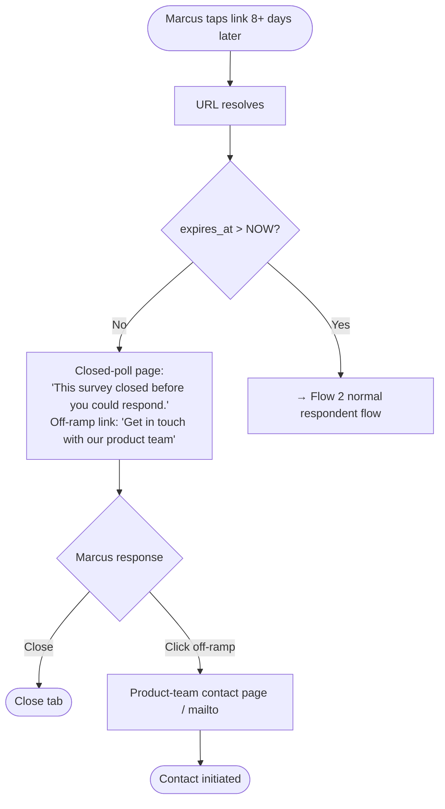

---
stepsCompleted:
  - step-01-init
  - step-02-discovery
  - step-03-core-experience
  - step-04-emotional-response
  - step-05-inspiration
  - step-06-design-system
  - step-07-defining-experience
  - step-08-visual-foundation
  - step-09-design-directions
  - step-10-user-journeys
  - step-11-component-strategy
  - step-12-ux-patterns
  - step-13-responsive-accessibility
  - step-14-complete
lastStep: 14
workflowStatus: complete
inputDocuments:
  - /home/tixeo/Projects/perso/kano/_bmad-output/planning-artifacts/prd.md
  - /home/tixeo/Projects/perso/kano/_bmad-output/planning-artifacts/prd-validation-report.md
  - /home/tixeo/Projects/perso/kano/initial-specification.md
decisions:
  theming: 'Single Vuetify theme serving both surfaces; respondent UI differentiates via layout/density/microcopy, not aesthetic register.'
  epochScope: 'v1 = single-epoch analysis view with navigation between epochs (tabs/selector). Cross-epoch side-by-side comparison deferred to v2 to protect NFR3 (single SQL round-trip).'
---

# UX Design Specification kano

**Author:** Kanaud
**Date:** 2026-04-21

---

## Executive Summary

### Project Vision

kano is an internal Tixeo tool that removes the tooling tax from Kano-methodology customer surveys. Tixeo PMs create projects and features in a desktop interface, generate a shareable plain URL, send it to customers through their own channels (email, chat), and read feature-by-feature categorized results ready to drop into a roadmap conversation. Customers receive a short, plain-language, mobile-friendly poll — no Kano jargon, no login, no tokens. The design treats respondent clarity as a first-class principle: methodology terminology never leaks to the customer surface; human-readable category names (Must-have, Delighter) appear on the PM surface alongside on-demand explanatory tooltips.

### Target Users

**Paola — Tixeo Product Manager (PM-facing, desktop).** Knows Kano methodology but is deterred by spreadsheet-based tooling. Needs empty state → shareable poll URL in under 5 minutes, and completed poll → quotable KPI-first analysis ready for a roadmap review. Works at a desk, ≥1280px viewport, familiar with enterprise B2B UIs.

**Marcus — Tixeo customer, poll respondent (respondent-facing, mobile).** Non-trained respondent who receives ~4 vendor surveys a month and ignores most. Opens the link from an email on a phone, potentially over cellular, likely one-handed, likely in-motion. Needs under 3 minutes, plain language, visible progress, no methodology vocabulary. Touch-first, ≥360px viewport.

### Key Design Challenges

1. **Epoch-bump confirmation — multi-state, diff-driven (FR8–12).** Not a single dialog. At minimum two states: (a) edit-in-place when the current epoch has zero responses (no bump, soft inline notice), and (b) confirmation dialog when responses exist (explicit PM acknowledgement per FR11). The trigger is a diff against the current epoch's feature set; the spec must name the exact set of fields whose change bumps vs. fields whose change does not. The dialog communicates a data-lifecycle contract to a non-engineer audience.

2. **Analysis page — accessible stacked bar + dominant + tie + empty state, one query (FR33–37, NFR3, NFR10).** Per-feature horizontal stacked bar, dominant category with percentage, tie handling that surfaces both dominant categories with shared %, per-category panels, zero-responses empty state. Paired with an accessible data-table fallback rendered from the same grouped result. Single SQL aggregation per view; cross-epoch side-by-side comparison explicitly out of v1 to protect NFR3.

3. **Respondent Likert on mobile — designed around Marcus's actual context.** Not a tap-count problem. A one-handed, in-transit, 4-out-of-10-motivation context where every friction point costs a full respondent (FR25 silent discard amplifies this). Pattern: stacked-vertical options, one question per screen, full-width tap targets, generous vertical spacing, thumb-reach-friendly, five long phrases visible without truncation. Horizontal and slider patterns explicitly rejected.

4. **Tixeo identity via a single Vuetify theme — foundational, not incremental.** One theme serving both surfaces: the Tixeo dark-sidebar + orange-primary aesthetic is native on the PM surface; the respondent surface uses the same theme tokens with layout-level adaptations (no sidebar on mobile, larger vertical spacing, wider form controls, one-thing-per-screen). **Acknowledged trade-off:** the respondent UI inherits the enterprise B2B register rather than a softer consumer register; mitigated at the respondent-surface level through layout, density, and microcopy choices. Theme defined day-one as a foundational artifact; audited at every screen review. Vuetify Material-3 defaults explicitly overridden where they fight the Tixeo look.

5. **Plain-language copy deck — UX-owned, repo-tracked, required before spec lock (FR20/22/38, deferred by PRD).** Single source of truth for every user-facing string: respondent questions, Likert option labels, PM-facing category names (Must-have, Delighter…), epoch terminology exposed as "Version" to the PM (never "epoch"), dialog copy, error copy, empty-state copy. Markdown table in-repo; code references string keys, not inline literals. The copy deck is a data-quality instrument — respondent copy drift silently corrupts the Kano categorization signal within a single session.

6. **Poll list / workspace — the PM home screen (FR2, FR18).** The surface Paola touches every session. List of polls across projects with enough context (project, epoch/version, response count, expiry, creation date) to answer "what's alive, what needs attention?" at a glance. Decides whether kano feels good to use on poll #2 and #3, not just poll #1.

7. **Share flow with respondent preview and landing first-impression (FR13–14).** Between "poll URL generated" and "Paola sends to 12 customers" is a trust moment — she's putting her name on a link to a revenue-bearing customer. Must include a preview affordance (QR-code-to-phone is the boring-tech path) so Paola sees what Marcus sees before sending. The respondent landing itself — first 400ms, clear value exchange ("2–3 min, helps us build the features you want") — is the highest-leverage screen in the product.

8. **Edge-state dignity (FR25, FR27, FR37).** Expired-link page with graceful closure and product-team off-ramp; no-responses-yet state that distinguishes "nothing yet" from "something's broken"; partial-response silent discard as a design pressure test to minimize abandonment; mid-survey network failure handling. Each edge state is a brand moment.

### Design Opportunities

1. **Analysis as a roadmap-ready artifact.** Composition legible in a screen-share, copy-friendly structure, screenshot-worthy. PM's stakeholders understand the output without a guided walkthrough.

2. **Epoch navigation as a first-class feature.** Tabs or version selector surfacing prior epochs on the project and analysis views — turn the engineering constraint into visible continuity. Navigation only in v1.

3. **Emotional arc across the respondent flow.** Landing sets trust; mid-flow microcopy acknowledges progress at the halfway valley; thank-you screen closes as a relationship artifact ("Your PM will see this within 24h") rather than a transaction.

4. **Paola's first-response confidence beat.** A single well-placed UI line on the analysis page that converts the "n=3, is this failing?" anxiety into informed patience ("3 of 12 so far — usually worth waiting for ~10 before reading patterns"). Turns an empty-state problem into a product-intelligence moment.

### Known Risks, Named but Deferred from v1

- **Response-rate / low-n warning on the analysis page.** PRD Growth Feature. The adoption risk (Paola presenting low-n data in a roadmap review) is real but v1 relies on Paola's judgement.
- **Analysis export / snapshot.** Not in PRD; screenshot is the v1 handoff path. Flag for v2 if Paola reports friction.
- **Partial-response resume on mobile.** PRD explicitly says FR25 silent discard; no session persistence in v1. Named for completeness.
- **Email draft helper (mailto: template).** Micro-feature out of v1. Paola uses her existing email/chat channels as the PRD envisions.

## Core User Experience

### Defining Experience

The core user experience is a **relay, not a single loop.** Two distinct audiences each own a phase of a four-phase arc:

- **Phase 1 — PM composes (desktop).** Empty project → features → poll URL. Target: under 5 minutes, measured in PM perceived effort.
- **Phase 2 — Hand-off (out of product).** PM shares the URL via her own channels (email, chat). Critical trust moment for Paola's reputation with the recipient.
- **Phase 3 — Respondent answers (mobile).** 8 features × 2 questions = 16 micro-decisions. Target: under 3 minutes, zero confusion signals, no abandonment.
- **Phase 4 — PM reads (desktop).** Analysis page yields a roadmap-ready categorized view. Target: interpretable on first view, quotable in a roadmap meeting without reformatting.

Each phase has a different actor, different core action, and different success criterion. The end-to-end experience succeeds only if **every phase holds** — a perfect authoring flow that lands on a broken mobile landing page still loses the respondent.

### Platform Strategy

- **PM surface — web, desktop only.** Vue 3 SPA with Vuetify, single theme, ≥1280px viewport. No mobile or tablet layout obligations. Mouse+keyboard input. Long-dwell authoring sessions; high-stakes analysis reading.
- **Respondent surface — web, mobile-first responsive.** Same Vue 3 SPA, same single Vuetify theme, ≥360px viewport. Touch-first Likert inputs. Bursty single-attempt sessions (FR25 silent discard; no resume). Likely over cellular, likely one-handed, likely in-transit.
- **Route-level separation.** PM routes under `/app/*`, respondent routes under `/poll/*` (or equivalent). Keeps responsive-breakpoint and layout logic from leaking between surfaces; supports per-route lean-bundle strategy for the respondent surface (small payload, fast first paint).
- **No native, no offline, no PWA in v1.** Browser-only, modern evergreens (latest two stable of Chrome, Firefox, Edge, Safari per PRD).
- **No auth, no signup, no token.** Plain URLs with 7-day TTL. Public access assumed throughout.
- **Accessibility is platform-level, not a feature.** WCAG 2.1 AA across both surfaces; `axe-core` in CI blocks regressions.

### Effortless Interactions

- **PM — drafting the feature list feels like typing into a doc, not filling a form.** Inline add, keyboard-driven (Tab to move between fields, Enter to commit, ⌫ on empty to delete). Copy-paste a multi-line list parses into multiple features. No modal dialog to add or edit a feature.
- **PM — poll URL copy and preview.** Single click copies the URL to clipboard with a visible confirmation. Adjacent QR code renders the mobile landing so Paola sees what Marcus will see without changing devices.
- **Respondent — one question per screen, auto-advance on selection.** Tap the chosen Likert option → the screen transitions to the next question without a Next button. Swipe- or tap-back to correct a prior answer. The thumb stays in the bottom two-thirds of the screen throughout.
- **Respondent — the 16-question sequence feels like one continuous experience.** No full page reloads, no loading flashes between questions. Progress bar animates across the full journey, not per-feature.
- **Analysis — no setup, no export, no calculation.** Load the page, read the answer. Dominant category and percentage pre-rendered alongside each feature; ties surfaced without a secondary click.
- **Epoch version switching — single click.** Tabs or selector at the top of the project/analysis view. No modal, no confirmation — switching views is read-only and reversible.

### Critical Success Moments

The moments where success is made or lost. Each maps to a named challenge in the Executive Summary.

1. **Paola's first poll URL, under 5 minutes from empty state.** The tooling-tax promise has to hold on attempt one. A form that demands four fields per feature at creation kills this moment silently.
2. **Paola's "can I send this to a paying customer?" moment.** Resolved by a working preview (QR-code-to-phone) that renders exactly what Marcus will see. If she hesitates on the send, the poll never ships.
3. **Marcus's first 400ms on the landing page.** Tap → trust-bearing landing ("Tixeo · 2–3 min · shapes our roadmap") → proceed. A weak landing kills the entire funnel before question 1.
4. **Marcus's question-6-of-16 valley.** Decision fatigue is real. A visible progress bar and a single microcopy acknowledgement ("halfway there — this is genuinely helpful") carries him through.
5. **Marcus's submit → thank-you transition.** Not a transaction. A small closing that names what happens next ("Paola will see this within 24h"). This is the only moment that earns a next-survey response.
6. **Paola's analysis-page first load.** Stacked bars rendered, dominant categories visible, no methodology jargon blocking comprehension. If she has to open a tooltip to understand "Must-have 71%", we've failed — but the tooltip is there (FR39) for the one-in-ten moment when she does.
7. **Paola's roadmap-review screen-share.** The analysis composition has to hold up when her VP of Engineering sees kano for the first time over her shoulder. Legibility at projector-zoom, no UI chrome distraction, self-explanatory.

### Experience Principles

Five principles that govern every subsequent UX decision in this spec.

1. **Respondent-side clarity is non-negotiable.** Plain language, always. No methodology term ever reaches the respondent surface. If a string choice forces the respondent to decode anything, the string is wrong.
2. **Two surfaces, one design language, different registers.** Single Vuetify theme, single orange accent, single type family — applied with different density, different chrome, different microcopy on each surface. Consistency at the token level; context-appropriateness at the layout level.
3. **Every friction point on the respondent surface costs a whole respondent.** FR25's silent-discard rule makes this literal. Design for the one-handed, 4-out-of-10-motivation, in-transit Marcus; every screen passes that bar or it gets reworked.
4. **The analysis page is the product's artifact, not its dashboard.** Designed to be screen-shared, screenshotted, and quoted in a roadmap review — not browsed. Composition, typography, and legibility optimize for the stakeholder who will see it for the first time over Paola's shoulder.
5. **Empty states, edge states, and first-use moments are the onboarding.** There is no tutorial, no doc, no support org (per PRD). The tool teaches itself through well-designed first-time surfaces.

## Desired Emotional Response

### Primary Emotional Goals

Two distinct audiences, two distinct primary emotional goals — not one averaged feeling.

**Paola (PM): *Authoritative confidence.*** Walks into the roadmap review knowing her evidence is solid, clear, and unassailable. Not "I have some data" but "here's what 12 customers said — 71% Must-Have on SSO." The tool makes her look prepared; the analysis makes her sound informed.

**Marcus (respondent): *Respected brevity.*** The three minutes he gave us feel like a fair exchange, not a drain. He leaves feeling he was heard, not interrogated. Intrinsic motivation of 4/10 is treated as the design baseline, not a failure mode.

### Emotional Journey Mapping

**Paola's arc:**

- **First session (empty state).** Curiosity + mild skepticism — "is this actually faster than my Google Form?" The tool must resolve that skepticism within five minutes, when she reaches a shareable URL.
- **During the poll (waiting for responses).** Patient trust. She's waiting on people outside her control; the UI must not trigger "did it break?" anxiety. Visible response count acts as a quiet confidence signal.
- **Analysis first-read.** Grounded clarity. Not wow-delight — something quieter. "Oh, that's the answer." The artifact should feel like evidence, not magic.
- **Roadmap-review screen share.** Public-facing authority. Her name is effectively on the analysis when she shares her screen; the composition has to make her look prepared in front of stakeholders.
- **Return sessions (poll #2 and #3).** Easy familiarity. No re-learning, no re-orientation. The home screen tells her what's alive and what needs attention at a glance.

**Marcus's arc:**

- **Email + tap.** Wary obligation — "another survey, Tixeo, fine." Motivation 4/10.
- **Landing.** Cautious acceptance — "OK, 3 minutes, I can give that." Resolves wariness into consent before question 1.
- **Mid-survey (Q6 valley).** Quiet persistence. Progress is visible; a single microcopy line acknowledges him. Feels seen, not drained.
- **Submit.** Small satisfaction — completion-closure, not wow. The thank-you screen names what happens next, converting a transaction into a relationship.
- **Expired-link case.** Disappointed, not angry. The page acknowledges he tried; the off-ramp to the product team restores his agency.

### Micro-Emotions to Prioritize

- **Confidence over confusion (Paola, on the analysis page).** Every methodology term is translated; tooltips reinforce, they don't gate access to meaning.
- **Trust over skepticism (Marcus, on the landing).** Tixeo name present, time estimate honest, value exchange explicit up front.
- **Accomplishment over frustration (Marcus, across the 16 questions).** Auto-advance on selection means momentum; never a stuck feeling.
- **Persistence over fatigue (Marcus, at Q6+).** Halfway milestone explicitly acknowledged through microcopy and progress-bar affordance.
- **Authority over anxiety (Paola, in the roadmap share).** Composition holds up at projector zoom; ties surfaced clearly so she doesn't have to explain away ambiguity.

### Emotions to Avoid

- **Paola — doubt in the data.** The analysis must never look provisional. If it's rendering, it's authoritative. No "check back later?" UI hedging.
- **Paola — shame about n.** When only 4 customers responded, the UI presents 4 respectfully: "4 of 12 so far," not "only 4."
- **Marcus — feeling interrogated.** Never ask for anything beyond the 16 answers. No email, no name, no "how did you hear about us." The PRD's NFR8 PII-avoidance is also an emotional decision.
- **Marcus — feeling stupid.** If a question or label requires decoding, he feels dumb. Plain-language Principle 1 prevents this.
- **Marcus — feeling tricked.** "3 minutes" must mean 3 minutes. The progress bar must be honest — no "surprise, 8 more questions" moment.

### Design Implications

Each emotion maps to concrete UX choices:

- **Authoritative confidence (Paola) → Analysis-page typography hierarchy makes the headline finding scannable in under 2 seconds.** Category name + percentage at dominant text weight; the stacked bar visually supports the already-resolved claim, doesn't demand interpretation.
- **Respected brevity (Marcus) → Aggressive minimalism on every respondent screen.** One question visible, one action available, nothing competing for attention. Progress bar as the only secondary element.
- **Trust (Marcus landing) → Tixeo brand anchor visible, time estimate near the primary CTA, no tracking/cookie/privacy friction up front.** The value exchange is stated once, honestly, before the first question.
- **Persistence (Marcus valley) → Progress bar animates meaningfully; halfway point is a visible milestone (subtle animation or color shift); microcopy acknowledges without patronizing.**
- **Patient trust (Paola during the poll) → Poll list shows response count that updates on view — no auto-refresh anxiety, no notification channels needed.** "5 of 12 responded" is a quiet confidence signal.
- **Disappointment, not anger (Marcus expired link) → Page copy acknowledges the intent ("this survey closed before you could respond"); off-ramp link is substantial, not a footnote.**

### Emotional Design Principles

1. **No wow moments on the respondent side; plenty on the PM side.** Marcus doesn't need to be delighted — he needs to be respected. Paola needs to be equipped with an artifact she's proud to share.
2. **Confidence is built by removal, not addition.** Every UI element on the analysis page either supports the headline finding or gets cut. Trust comes from clarity, not from reassurance copy.
3. **Edge states carry as much emotional weight as happy paths.** Expired links, zero-response states, partial abandonment — designed with the same care as the success flows. The brand is measured where users stumble.
4. **Honesty is an emotional feature.** "3 minutes" means 3 minutes. "5 of 12" is more honest than "just getting started." Progress bars don't fake progress.
5. **Tone matches audience, not product.** Paola gets enterprise precision. Marcus gets warm brevity. Same product, same design system, two voices.

## UX Pattern Analysis & Inspiration

### Inspiring Products Analysis

No single reference product. Instead, canonical patterns drawn per sub-problem, each matched against an exemplar product for calibration. Adoption is sub-problem-specific, not product-wide.

#### Sub-problem 1 — Respondent one-question-per-screen Likert flow

- **Exemplar: Typeform.** Full-viewport question focus, auto-advance on selection, keyboard affordance (1–5 to pick), warm-but-minimal chrome, honest progress bar, no "Next" button.
- **Why it fits:** maps directly onto Experience Principle 3 (every friction point costs a whole respondent) and the "Respected brevity" emotional goal.
- **What to adopt:** single-question viewport, auto-advance, minimal chrome.
- **What to adapt:** Typeform's brand register is playful-conversational; ours stays professional-warm. No animated emoji, no "friendly" small talk between questions — respect beats cuteness on a vendor survey.
- **What to reject:** Typeform's aggressive fullscreen takeover on mobile browsers; keep ours within the browser shell.

#### Sub-problem 2 — PM home / poll list view

- **Exemplar: Linear (Issues list) and Notion (database table).** Dense but legible rows, status dot / tag column, hover affordances, keyboard navigation, no decorative chrome.
- **Why it fits:** Paola at home screen every session (Challenge 6); enterprise B2B register; long-dwell scanning task.
- **What to adopt:** row-based list with essential columns (project, version / epoch, response count, expiry countdown, created date), no cards.
- **What to adapt:** Linear's keyboard-shortcut density is overkill for a 3-poll-a-quarter PM; include the basics (↑↓ navigate, Enter to open) but don't depend on them.

#### Sub-problem 3 — PM inline-editable feature list (no modals)

- **Exemplar: Linear issue fields and Notion cell edits.** Click a field → it becomes editable in place; Tab moves to the next field; Enter commits; Esc cancels. No modal dialogs.
- **Why it fits:** Effortless Interaction #1 in the Core Experience section — "drafting the feature list feels like typing into a doc, not filling a form."
- **What to adopt:** inline edit on name + description; keyboard-first commit/cancel; no save button per row.
- **What to adapt:** add a copy-paste parse affordance — pasting a multi-line list into the feature area creates one feature per line. Not present in either exemplar; it's a kano-specific accelerator.

#### Sub-problem 4 — Analysis page as artifact (not dashboard)

- **Exemplar: Linear Insights and Stripe Dashboard's headline cards.** One primary finding per card, typography-led, chart supports the headline rather than leading it. Copy-paste-friendly layout.
- **Why it fits:** Experience Principle 4 — the analysis page is a screen-shared, screenshotted artifact, not a browsed dashboard.
- **What to adopt:** per-feature card with dominant category + % as the headline in large type, stacked bar beneath as visual support, category name spelled out ("Must-have") not abbreviated.
- **What to reject:** multi-widget dashboard patterns (Grafana, Datadog, Google Analytics) — they require interpretation. Paola needs pre-resolved claims, not charts to explore.

#### Sub-problem 5 — Share flow (URL + QR preview)

- **Exemplar: Google Calendar event share, Zoom meeting share.** Copy URL button with clear confirmation, QR code visible adjacent for immediate mobile preview, link is the first and largest element.
- **Why it fits:** Critical Success Moment 2 — Paola's "can I send this to a paying customer?" moment; QR resolves it without a manual device switch.
- **What to adopt:** URL-prominent, one-click copy, QR rendered in the same card, visual confirmation ("Copied" flash) on the button.

#### Sub-problem 6 — Destructive / consequential confirmation dialogs

- **Exemplar: GitHub's type-to-confirm for repo-deletion-class actions; Figma's lighter confirmations for reversible ones.**
- **Why it fits:** Challenge 1 (epoch-bump dialog, multi-state) — empty epoch = soft inline notice (Figma register); populated epoch = explicit acknowledgement (GitHub register, minus the type-to-confirm because epoch-bump is reversible via a new poll).
- **What to adopt:** two dialog registers — a soft inline banner for the empty-epoch grace case, a modal-with-explicit-ack for the has-responses case.
- **What to reject:** type-to-confirm — overkill for a non-destructive action (prior data is preserved, just frozen).

#### Sub-problem 7 — Epoch / version selector

- **Exemplar: Figma version history panel, Google Docs version history.** Tabs or a selector showing version + date + summary; one version visible at a time; clicking another version loads that view.
- **Why it fits:** Design Opportunity 2 — epoch navigation as first-class feature. v1 is navigation-only (per our epoch-scope decision).
- **What to adopt:** tab or selector at the top of the project + analysis views, showing version number + creation date + response count per version; current version highlighted.
- **What to reject:** side-by-side diff views (Figma) — maps onto the cross-epoch comparison we explicitly deferred to v2.

#### Sub-problem 8 — Empty states as onboarding

- **Exemplar: Linear's first-project empty state, Basecamp's "let's-get-started" pattern.** Empty state is itself the primary action — one visible CTA, short explanatory copy, no multi-step tutorial.
- **Why it fits:** Experience Principle 5 — empty states are the onboarding.
- **What to adopt:** project-list empty = single "Create your first project" CTA; feature-list empty = a single inline input ready to type into; analysis page with zero responses = explanatory microcopy + response count ("0 of 12 responses so far") distinguishing "nothing yet" from "broken."

### Transferable UX Patterns

| Pattern | Exemplar | Applies to | Why |
|---|---|---|---|
| One-question-per-screen, auto-advance, honest progress | Typeform | Respondent flow | Respected brevity + friction cost |
| Dense row-based list, keyboard-navigable | Linear / Notion | PM home / poll list | Long-dwell scanning, B2B register |
| Inline edit, no modals, Tab/Enter/Esc | Linear / Notion | Feature authoring | Effortless Interaction 1 |
| Copy-paste multi-line parse | kano-specific | Feature authoring | Accelerator; no exemplar |
| Headline-led card composition | Linear Insights / Stripe | Analysis page | Artifact, not dashboard |
| URL + adjacent QR, one-click copy | Google Calendar / Zoom | Share flow | Critical Success Moment 2 |
| Two-register dialogs (inline soft + modal firm) | Figma + GitHub | Epoch-bump confirmation | Multi-state Challenge 1 |
| Version selector (navigation, no diff) | Figma / Google Docs | Epoch navigation | Design Opportunity 2 |
| Empty-state-as-onboarding | Linear / Basecamp | All first-time surfaces | Experience Principle 5 |

### Anti-Patterns to Avoid

- **Multi-page Likert with explicit "Next" buttons.** (Qualtrics, SurveyMonkey.) Doubles the tap count, signals bureaucratic heaviness, triggers abandonment in the Q6 valley. Auto-advance is load-bearing.
- **Modal dialogs for every add / edit.** (Common B2B pattern.) Breaks keyboard flow, forces context switch, fights Effortless Interaction 1.
- **Multi-widget analytics dashboards.** (Grafana, Datadog, Google Analytics.) Designed for exploration, not for claim-making. Paola needs an artifact, not a workbench.
- **Identical-looking confirmation dialogs for reversible and irreversible actions.** Trains users to click-through, which is catastrophic on FR11. The two epoch-bump dialog registers must *look* different.
- **Progress bars that don't reflect reality.** "Almost done!" at 30% is a betrayal. Ours shows true fraction (`question N of 16`), animates meaningfully.
- **Long onboarding tutorials.** Product teaches itself through empty states and first-use tooltips (FR39), not through a carousel.
- **Hidden / auto-filled PII collection.** (Email asks, cookie banners with "Accept All" as the primary CTA, "help us improve" opt-ins.) Breaks NFR8 and the emotional goal of Respected Brevity.
- **"Loading…" spinners on the respondent flow.** Every perceptible delay erodes motivation. Prefer optimistic transitions and pre-rendered next questions.

### Design Inspiration Strategy

**What to adopt directly:**

- Typeform's one-question-per-screen Likert mechanic (adapted to professional register)
- Linear / Notion inline-edit model for feature authoring
- Linear Insights headline-card composition for the analysis page
- Google Calendar URL + QR share pattern

**What to adapt:**

- Figma + GitHub two-register confirmation model for the epoch-bump multi-state dialog (soft inline + firm modal)
- Figma / Google Docs version selector for epoch navigation (reject the side-by-side diff affordance)
- Linear / Basecamp empty-state-as-onboarding applied across all first-use surfaces

**What to explicitly reject:**

- Typeform's playful-conversational brand register (we're professional-warm)
- Dashboard-style analytics widgets on the analysis page
- Any pattern requiring a "Next" button on the respondent flow
- Modal dialogs for non-consequential actions
- Type-to-confirm on the epoch-bump dialog (non-destructive action)
- Side-by-side cross-epoch comparison (deferred to v2)

## Design System Foundation

### Design System Choice

**Vuetify 3** (latest stable, Vue 3 composition API), themed once and served to both the PM surface and the respondent surface. This is a *themeable-system* approach (option 3 in the standard taxonomy) — proven component foundation, brand-level customization on top.

No custom design system from scratch. No Material Design defaults left visible. Single themed Vuetify instance for the entire SPA.

### Rationale for Selection

- **Technical fit.** The PRD mandates Vue 3 composition API (§Project Classification). Vuetify is the Vue 3 component library with the deepest component coverage, strongest accessibility primitives, and most mature theming API — a direct match for solo-dev velocity without cutting corners on WCAG 2.1 AA (NFR9).
- **Component coverage that maps onto our surfaces.** Everything we've committed to — data tables (poll list), inline-editable fields (feature authoring), modal + inline banners (epoch-bump two-register dialogs), radio-group components (respondent Likert), tabs (epoch navigation), dialogs, progress indicators, tooltips (FR39) — is provided by Vuetify out of the box. Custom build is reserved for the stacked-bar analysis visualization (no good Vuetify primitive for that specific chart shape).
- **Accessibility baseline.** Vuetify ships keyboard navigation, focus management, ARIA attribution, and color-contrast hooks by default. Meeting WCAG 2.1 AA becomes a theming and custom-component discipline, not a ground-up rebuild.
- **Tixeo identity absorbability.** The Tixeo look (dark sidebar, white content on light gray, orange primary, rounded outlined inputs, minimal flourish) is achievable via Vuetify's token system — primary color, surface palette, elevation scale, density defaults, typography overrides. Material 3 defaults that fight the Tixeo look (Material elevation shadows, filled buttons, floating-label inputs) are explicitly overridden.
- **Solo-dev timeline realism.** Kanaud is solo on personal time (per PRD §Scope Strategy). Custom design system would consume 40–60% of the UX budget on foundation before a single user-facing screen exists. Rejected. Pure Material defaults would leave kano feeling like "just another Material app" and miss the Tixeo identity alignment the user explicitly flagged. Rejected. Vuetify + Tixeo theme is the only option that respects both the constraint and the identity.
- **Consistency with the single-theme decision (Step 2).** One theme serves both surfaces. Layout, density, and microcopy differentiate the PM register (dense, sidebar-present) from the respondent register (spacious, no sidebar, one-thing-per-screen). Single theme guarantees token-level consistency; layout layer provides surface-appropriate register.

### Implementation Approach

- **Setup.** Vuetify 3 installed as Vue plugin; single `createVuetify()` instance with the custom Tixeo theme applied globally. No per-surface or per-route theme switching — layout and density vary by route, not by theme.
- **Theme structure** (day-one foundational artifact per Challenge 4):
  - `colors`: Tixeo orange as `primary`; neutral grayscale for `surface` and `on-surface`; near-black for `surface-variant` (the dark sidebar); semantic tokens for `success`, `warning`, `error`, `info` chosen to coexist with orange as the dominant accent.
  - `typography`: Tixeo sans-serif family (exact font to confirm during low-fidelity design — if no Tixeo webfont exists, use Inter as a practical substitute with matching geometric proportions); type scale derived from Material 3 but with tighter line-heights for the PM density register.
  - `elevation`: Material's default shadow scale overridden — Tixeo uses minimal shadow. Borders carry visual separation instead of shadow on most components.
  - `density`: default `comfortable` for the PM surface, `default` for the respondent surface. Applied at component layer, not theme layer.
- **Component strategy.**
  - **Adopt directly:** `v-data-table`, `v-text-field`, `v-textarea`, `v-btn`, `v-dialog`, `v-tabs`, `v-progress-linear`, `v-tooltip`, `v-snackbar`, `v-app-bar`, `v-navigation-drawer`, `v-icon`, `v-card`, `v-list`, `v-radio-group`, `v-alert`.
  - **Build custom on top of primitives:**
    - Respondent Likert control (stacked-vertical full-width cards; Vuetify's `v-radio-group` primitives wrapped with custom layout and full-width tap targets).
    - Per-feature analysis card (headline-led composition from Sub-problem 4; Vuetify `v-card` with custom internal layout).
    - Stacked-bar Kano distribution (SVG, not Vuetify; paired with an accessible `v-data-table` fallback per NFR10 rendered from the same grouped result).
    - QR-code preview component (QR generation via a library; displayed inside a `v-card`).
    - Epoch two-register confirmation dialogs (one `v-alert` variant for the soft inline notice; one `v-dialog` variant for the firm modal).
  - **Explicitly not used:** `v-bottom-navigation` (no mobile nav shell; respondent surface is chromeless), `v-stepper` (Likert flow uses a linear progress bar, not stepper chrome), `v-expansion-panels` (analysis is artifact, not explorable dashboard).
- **Override discipline.** A Tixeo-theme audit runs at every screen review during downstream UX work: no screen ships with visible Material-3 defaults (default orange shades, default elevation shadows, default icon set if it clashes). This is the "foundational artifact, audited at every review" commitment from Challenge 4.

### Customization Strategy

- **What gets themed centrally** (via the Vuetify `createVuetify()` config): colors, typography, elevation, base component defaults, icon font.
- **What gets overridden at component-defaults level** (per-component `VBtn: { variant: 'flat' }` style configuration): button style, input appearance, card elevation, list density.
- **What stays per-route / per-layout** (not theme): surface layout (with vs without sidebar), density (comfortable vs default), container width, microcopy tone.
- **Icon set.** Use `mdi` (Material Design Icons) for breadth. Custom Tixeo icons only if the brand has established mark variants that need to appear (not evident from the current screenshot; assume `mdi` is sufficient).
- **Typography fallback.** If a Tixeo-branded webfont is not available for a public-internet-reachable deployment, adopt **Inter** (variable font, open license, geometrically close to the screenshot's sans-serif). Confirm this during low-fidelity design rather than guessing now.
- **Dark mode.** Not in scope for v1. The Tixeo screenshot is a light-mode interface with a dark sidebar; that duality is handled via surface palette, not a light/dark theme toggle. Growth-Features candidate; not a v1 constraint.
- **Internationalization.** Vuetify supports i18n; not a v1 requirement (per PRD — internal Tixeo tool). But the copy-deck artifact (Challenge 5) is structured to be i18n-ready: string keys, not inline literals, so a future i18n migration is a translation effort, not a refactor.

## Defining Experience

### The Defining Interaction

**"Read your customers' truth at a glance."**

The defining interaction is **the PM's first scan of the analysis page** — a single composed moment where, for each feature, the dominant Kano category and its percentage are grasped in under two seconds of reading time. No calculation. No methodology decoding. No workbench navigation. Just a scan that converts a column of rows into a roadmap claim.

This is kano's equivalent of Tinder's swipe, Spotify's play — the interaction that, if it works, makes the product indispensable; if it fails, nothing else matters.

Everything else in the product — the authoring flow, the URL share, the respondent Likert, the epoch navigation — exists to make this moment possible and repeatable. The respondent's tap-to-categorize flow is the collection pillar without which there's no data to scan; the PM's authoring flow is the setup without which there's no poll. But the moment that earns the product's place on Paola's Wednesday is the scan.

### User Mental Model

**What Paola brings to the scan:**

- She knows Kano methodology well enough to have attempted it manually — once, in a Google Sheet, painful. She remembers the six categories (Must-Have / Must-Be, Performance / Linear, Delighter / Attractive, Indifferent, Reverse / Contradictory, Questionable / Doubtful) but not the letter codes.
- She expects per-feature results, not aggregate. The whole point is to compare features against each other.
- She expects the result to look like *evidence* — specific, numeric, quotable — not like a dashboard that requires her to draw her own conclusions.
- She is **not** expecting a magical insight. She's expecting a competent translator: *"here's what the 12 customers said, categorized."*

**Where she's likely to get confused or frustrated:**

- If the UI uses letter codes (M/L/E/I/C/D) as primary labels, she stalls to decode. The copy deck maps these to human-readable names (Must-have, Delighter, Performance, Indifferent, Reverse, Questionable) and the UI leads with those.
- If a feature is tied between two dominant categories, she expects to see *both* categories — not the tool picking one arbitrarily, not a "tie" placeholder. FR35 mandates this; the UX has to make it feel informative rather than confusing.
- If she sees n=3 responses and no context, she'll either over-claim ("71% Must-Have!") or hide the result entirely. The confidence-beat microcopy ("3 of 12 so far — usually worth waiting for ~10") converts this anxiety into patience.

**What she's used to doing instead:**

- Running the survey in Google Forms → exporting to Google Sheets → manually applying the Kano categorization matrix to each row → pivot-tabling by feature → eyeballing the dominant category. Three hours of clerical work that decays her confidence in the output.
- Or: ad-hoc free-text surveys → reading every response → synthesizing in her head → arguing the result in a roadmap meeting. Even more fragile.

The kano scan *replaces* both. That's the value exchange the defining experience delivers.

### Success Criteria for the Defining Experience

The scan succeeds when all of these hold:

- **Time-to-claim ≤ 2 seconds per feature.** Paola reads "SSO → Must-have 71%" and can quote it without re-reading. Scaled: an 8-feature poll is fully read in ≤ 16 seconds of scan time.
- **Zero decoding required for the claim.** No letter codes in the headline. No unexplained chart axes. No "check the tooltip for what this means" for the primary reading. Tooltips (FR39) exist for the one-in-ten-moment of curiosity, not as the decoding path for the default-reading.
- **Ties are informative, not ambiguous.** When a feature ties between Must-have and Performance at 40% + 40%, Paola reads "Must-have / Performance — 40% each" and understands that both categories are dominant with equal confidence. No mental arithmetic; no "did the tool fail?"
- **Composition survives a screen-share.** The scan holds at projector-zoom during Paola's roadmap review. Stakeholders seeing kano for the first time can follow the claim without Paola's commentary.
- **The claim is copy-paste-worthy.** Paola can quote "SSO: Must-have (71%)" into a roadmap doc or Slack message without reformatting. The UI composition makes the quotable unit visually distinct.
- **Confidence calibration is visible without being intrusive.** "Based on N responses" is present somewhere on the page — not as a header warning, not as a blocking banner, but as a quiet secondary line that makes Paola aware of her sample without making the result feel provisional.

### Novel vs. Established Patterns

**Mostly established, one deliberate novelty.**

**Established, proven patterns to adopt:**

- Per-feature card composition with headline-led typography (Linear Insights, Stripe Dashboard).
- Horizontal stacked bar for categorical distribution (standard data-viz grammar; broadly understood).
- Per-category panel listing features where that category is dominant (standard grouping pattern; Linear-like or a bulleted index).
- Tooltip/help affordance on demand (FR39) for first-use comprehension.

**The one deliberate novelty: tie-state display.**

Standard dashboard patterns pick a single "winner" when two categories are tied; kano refuses to. FR35 requires both dominant categories to be displayed together with the shared percentage, and the UX must make this feel *informative* rather than *broken*. No proven pattern exists for "two equal winners shown as one claim." The invention space is narrow:

- Headline reads both category names joined by `/` or `&` ("Must-have / Performance — 40%").
- The stacked bar shows both segments at equal weight with a visual treatment (e.g., connected underline, shared emphasis border) that marks them as *jointly dominant*.
- The per-category panels show this feature under both category headers, not duplicated-and-hidden.

This is kano-specific. No Typeform, Linear, or Stripe pattern covers it. Worth prototyping early during low-fidelity design.

**What to invent vs. what to defer:**

- **Invent** the tie-state treatment above.
- **Defer** (do not invent) anything around cross-epoch comparison, export formatting, or drill-down views — v1 is navigation-only per our epoch-scope decision.

### Experience Mechanics

Breaking the defining scan into its mechanical steps.

**1. Initiation.** Paola opens kano on Wednesday to check on her Monday poll. From the PM workspace (Challenge 6), she clicks the poll row. A single click takes her to the analysis page — no intermediate "analysis ready?" check, no loading interstitial beyond the initial render.

**2. Interaction.** She reads. That is the interaction. The scan reads top-to-bottom through the per-feature cards, taking in headline + percentage for each. If a feature catches her attention (a tie, a surprising result), she may hover (or focus with keyboard) on the stacked bar to reveal per-category counts via Vuetify tooltips. If she needs a refresher on what "Must-have" means, FR39 gives her an on-demand help affordance — a small (i) icon next to the category name, reveals a short definition on hover/focus. Low-dependency; not a gating affordance.

**3. Feedback.** No explicit feedback moment — the scan *is* the feedback. The system's correctness is communicated by coherence: the categorization feels right, ties are handled transparently, the response count matches her memory of how many customers she emailed. If anything feels off, she drills into the per-category panels to cross-check — which features land in Must-have, which in Delighter, etc. The panels are the *second-read* surface.

**4. Completion.** There is no explicit "done" action — the scan ends when Paola has read what she came for. She may screenshot (v1 handoff path — no native export). She may share-screen to roadmap review (Critical Success Moment 7). She may close the tab. Or she may navigate to the epoch selector to view a prior version's analysis for comparison.

**Layered repeat-use mechanic:** on subsequent views (poll is still collecting responses), the response count is higher and the stacked-bar distribution is denser. The scan mechanic is stable; only the data beneath it changes. Paola's mental model doesn't need to update between session 1 and session N.

### How Everything Else Supports the Defining Experience

- **The authoring flow** (feature-list inline edit, QR preview, share URL) exists to make the scan's *inputs* trustworthy.
- **The respondent Likert flow** (stacked-vertical, auto-advance, one-question-per-screen) exists to make the scan's *data volume* maximally honest — every friction point on the respondent side costs a row on Paola's scan.
- **The epoch-bump dialog** (multi-state, diff-driven) exists to ensure the scan is never reading corrupted cross-version data.
- **The plain-language copy deck** exists to ensure the scan's labels are unambiguous in both directions (respondent input, PM reading).
- **The Tixeo Vuetify theme** exists to ensure the scan composition holds up in a screen-shared roadmap review — brand-consistent, professional, not "just another Vuetify app."

Every other design decision in this spec is in service of making this one scan possible, honest, and repeatable.

## Visual Design Foundation

### Color System

**Source of truth.** Extracted from the provided Tixeo interface screenshot. Hex values are calibrated estimates; confirm against the live Tixeo brand palette (color-picker on the reference interface or a Tixeo brand kit) before locking low-fidelity designs.

#### Core palette

| Token | Hex (approx) | Usage |
|---|---|---|
| `primary` (Tixeo orange) | `#E36A2F` | Primary-action buttons, active tab underline, progress bar fill, selected-state accents |
| `on-primary` | `#FFFFFF` | Text/icons on primary-colored surfaces |
| `surface` | `#FFFFFF` | Content panels, cards, dialogs, form inputs |
| `surface-bright` | `#F7F8FA` | Page background, table zebra rows |
| `surface-variant` (sidebar) | `#1C1F26` | PM sidebar navigation, PM top nav if present |
| `on-surface` | `#1A1D23` | Primary text on light surfaces |
| `on-surface-variant` | `#6B7280` | Secondary text, form labels, metadata |
| `on-surface-dark` | `#FFFFFF` | Text/icons on the dark sidebar |
| `on-surface-dark-variant` | `#9AA0AB` | Secondary text on dark sidebar (e.g., the "Ressources" group label in the Tixeo screenshot) |
| `outline` | `#D1D5DB` | Input borders, card borders, table dividers |
| `outline-variant` | `#E5E7EB` | Subtle separators, secondary borders |

#### Semantic palette (coexists with orange primary)

| Token | Hex (approx) | Usage |
|---|---|---|
| `success` | `#15803D` (green-700) | Confirmation toasts, successful-copy flash |
| `warning` | `#CA8A04` (amber-600) | Epoch-bump dialog accent, expired-link notices |
| `error` | `#B91C1C` (red-700) | Form validation failures, critical errors |
| `info` | `#1D4ED8` (blue-700) | Informational callouts; rare |

Chosen to avoid competing with `primary` for attention. Never use `success` green as a primary action color — orange owns primary-action territory.

#### Kano category palette (load-bearing for the defining experience)

The six Kano categories appear in the stacked bar, per-category panels, and every analysis-page reference. They must be (a) WCAG 2.1 AA against the white `surface`, (b) distinguishable to the most common color-vision deficiencies, and (c) emotionally neutral — "Must-have" must not look alarm-coded and "Reverse" must not look success-coded.

| Category | Hex (approx) | Role |
|---|---|---|
| Must-have | `#1E3A8A` (indigo-800) | Weightiest, most "serious" color — reflects the category's weight in decision-making |
| Performance | `#0D9488` (teal-600) | Engineered, measured — continuous-positive feel |
| Delighter | `#7C3AED` (violet-600) | Distinct from orange primary to avoid accent clash; communicates "aspirational positive" |
| Indifferent | `#6B7280` (gray-500) | Neutral gray — visually quiet, non-claim-making |
| Reverse | `#B45309` (amber-700) | Warm but non-red — signals opposition without reading as "error" |
| Questionable | `#78716C` (stone-500) | Muted warm gray — "uncertain, needs more data" |

**Validation required before lock:**

- Test with a color-blindness simulator (protanopia, deuteranopia, tritanopia). Adjust any categories that collapse visually in the stacked bar.
- Confirm AA contrast of each category against `#FFFFFF` surface and against the adjacent category (stacked bar has color-against-color edges).
- Reserve the Tixeo orange (`#E36A2F`) *exclusively* for primary-action and progress UI — it is never a Kano category color.

Consider the Okabe-Ito colorblind-safe palette as a substitute set if the above doesn't pass simulator checks.

#### Accessibility contrast commitments

- Body text on `surface`: minimum 4.5:1 (WCAG AA normal text).
- Large text (≥18.66px or ≥14px bold) on `surface`: minimum 3:1.
- Non-text UI (icon strokes, input borders, progress-bar fill against background): minimum 3:1.
- Focus ring: minimum 3:1 against both adjacent background colors.
- Tested: any composition that combines `primary` orange on `surface` white meets AA for UI text at 16px+ weight; at small weights, pair orange with white only as solid button background, not as text on white.

### Typography System

**Primary typeface.** Tixeo sans-serif — the font visible in the provided Tixeo interface screenshot. The specific family is not yet confirmed; resolve at low-fidelity design start by:

1. Inspecting the live Tixeo interface's CSS `font-family`.
2. If the family is a licensed webfont available for kano's public-internet deployment, adopt it.
3. Otherwise, adopt **Inter** (variable, open license, geometrically close to the Tixeo screenshot). Inter is the practical fallback.

**Monospace.** Not required for v1 — no code surfaces. Vuetify default mono (SFMono / Consolas) is acceptable for any edge case (debug views, etc.).

#### Type scale

Based on a 1rem = 16px root; rem-based throughout for respondent mobile zoomability.

| Role | Size (rem / px) | Weight | Line height | Where used |
|---|---|---|---|---|
| Display | 2.0 / 32 | 700 | 1.2 | Analysis-card headline ("Must-have 71%") |
| H1 | 1.5 / 24 | 600 | 1.25 | Page titles (PM) |
| H2 | 1.25 / 20 | 600 | 1.3 | Section titles, analysis page secondary headings |
| H3 | 1.0 / 16 | 600 | 1.4 | Subsection / card titles |
| Body (PM) | 0.875 / 14 | 400 | 1.5 | PM-surface body text, table rows, form fields. Matches the Tixeo screenshot's density |
| Body (respondent) | 1.0 / 16 | 400 | 1.55 | Respondent questions, Likert option labels; minimum 16px for mobile readability |
| Body-large (respondent question) | 1.125 / 18 | 500 | 1.45 | The question being answered — one-per-screen focus |
| Label | 0.875 / 14 | 500 | 1.4 | Form labels, table headers, navigation |
| Caption | 0.75 / 12 | 400 | 1.4 | Metadata, secondary context (response counts, timestamps) |

**Two body sizes by design.** PM surface at 14px matches Tixeo's dense enterprise register; respondent surface at 16px is the mobile-readability minimum. Single theme, two density registers — matches the single-theme decision from Step 2.

#### Typography principles

- **Hierarchy by weight and size together, not by color.** Secondary text is lighter (`on-surface-variant`), not colorful. Orange is never a type-color choice.
- **Tabular numerals for statistics.** Percentages in the analysis headline ("71%") and response counts ("5 of 12") use the typeface's tabular-numeral variant so they don't jitter in scannable columns.
- **Line-height reflects density register.** PM tables use 1.4–1.5; respondent reading surfaces use 1.5–1.6 for comfort.
- **No decorative display typefaces.** Everything is Tixeo sans-serif (or Inter). Zero serif exceptions, zero script faces.

### Spacing & Layout Foundation

**Base unit: 4px.** All spacing values are multiples of 4.

#### Spacing scale

| Token | Value | Usage |
|---|---|---|
| `space-1` | 4px | Icon-to-text tight pairing, tag padding |
| `space-2` | 8px | Small intra-component gaps, inline form spacing |
| `space-3` | 12px | Form-field vertical rhythm (PM), card internal padding tight |
| `space-4` | 16px | Default card padding, mobile gutter, button vertical padding |
| `space-6` | 24px | Section spacing, PM desktop gutter, card outer spacing |
| `space-8` | 32px | Major section breaks, page-section margin |
| `space-12` | 48px | Large layout breaks (top of page hero, etc.) |
| `space-16` | 64px | Page-level vertical rhythm (sparing) |

#### Layout principles

1. **PM surface: dense but legible.** 24px gutters, 16–24px card padding, 14px body. Matches the Tixeo screenshot density. Inspired by Linear/Notion table-first compositions.
2. **Respondent surface: spacious and thumb-safe.** 16px lateral mobile gutter, 24px+ vertical rhythm between question elements, ≥44px touch targets on all Likert options. One-thing-per-screen layout.
3. **Cards over shadows for separation.** Thin 1px `outline` borders separate content blocks; heavy Material elevation shadows are overridden to 0 on most components (per Step 6 implementation approach). The Tixeo screenshot uses this pattern.
4. **Content-max widths:** PM page content capped at 1280–1440px centered in the viewport; respondent content capped at 480px centered (avoid wide-line-length reading on unexpected large-screen access).

#### Grid system

- **PM (desktop).** 12-column grid, 24px gutters, ≥1280px viewport, content container max-width 1440px. Dense-table layouts ignore the 12-column grid and span full-width of the content container.
- **Respondent (mobile-first).** No grid — single-column flow. 16px lateral padding on mobile; content container max-width 480px on desktop access to respondent surface (preserves mobile-intended composition when someone opens the poll URL from a laptop).

### Accessibility Considerations

WCAG 2.1 Level AA is platform-level (per Experience Principle / NFR9), not a feature. This section names the specific commitments the visual foundation has to carry.

- **Color contrast.** Every text/background pairing in the foundation hits AA minimums (tested per the contrast commitments above). Category palette tested against colorblind simulators before lock.
- **Color is never the sole information carrier.** Stacked-bar categories are reinforced with category name labels (category name + % visible in every tie, not just color-coded segments). The accessible data-table fallback (NFR10) renders from the same grouped result and is always available to screen readers.
- **Focus states are first-class.** Every interactive element has a visible focus ring using a 2px outline in `primary` orange at 3:1+ contrast against both adjacent backgrounds. No `outline: none` anywhere.
- **Touch targets.** Respondent surface interactive elements are ≥44×44px per WCAG 2.5.5 guidance; the stacked-vertical Likert cards are ~56–64px tall with full-width hit area.
- **Text zoom.** Rem-based type scale throughout so respondent browser-zoom up to 200% reflows cleanly. No fixed-pixel layout traps.
- **Motion.** Any transition (auto-advance between Likert questions, progress-bar animation, copy-to-clipboard flash) respects the `prefers-reduced-motion` media query and collapses to instant state changes when that preference is set.
- **Keyboard parity.** Every mouse/touch affordance has a keyboard equivalent: tab-nav through forms, Enter/Space to trigger buttons, arrow-key navigation in Likert and tabs, Escape to close dialogs. Tested via `axe-core` in CI (NFR11).
- **Screen-reader semantics.** `aria-label` on icon-only buttons; `aria-live="polite"` region for dynamic announcements (copy-to-clipboard confirmation, form validation); the stacked-bar SVG has `role="img"` + `aria-labelledby` pointing at the accessible data-table that renders the same data.

## Design Direction Decision

### Design Directions Explored

Three compositional variations for the analysis page (the defining interaction per Step 7) were prototyped in `ux-design-directions.html` with the Tixeo Vuetify palette applied and an illustrative 6-feature / 12-response dataset including a tie state:

- **Direction 1 — Card-Grid.** 2-column layout of per-feature cards; 32px percentage as the headline, stacked bar underneath as visual confirmation. Inspired by Linear Insights and Stripe Dashboard headline cards.
- **Direction 2 — Table-Row.** Column-aligned table with feature, dominant percentage + badge, stacked bar, and response count on one horizontal line. Inspired by Linear issue lists and GitHub insights tables.
- **Direction 3 — Split-View.** Feature list on the left with mini-bars; rich detail panel on the right with full legend and tie-state explanation. Inspired by Apple Mail / iA Writer-style master-detail layouts.

Other major surfaces (PM home poll list, feature authoring, respondent Likert, share flow) were not re-explored — their patterns converged earlier in Steps 3–8 and are already locked (see Inspiration Analysis, Sub-problems 1–8).

### Chosen Direction

**Direction 2 — Table-Row.**

Per-feature data renders as a single row in a column-aligned table on the analysis page. Columns:

| Column | Content |
|---|---|
| Feature | Name (bold, 14px) + description (12px, muted) |
| Dominant | Percentage (20px bold, color-matched to category) + category badge(s) below |
| Distribution | Full-width stacked bar, 12px tall, 6-category segments |
| n | Response count, tabular numerals, right-aligned |

Ties render in the Dominant column as the percentage followed by "each" and both category badges joined by `/`. The stacked bar shows the two tied segments at equal width with no special ornamentation — equal width is itself the visual signal.

Standard PM row affordances: hover highlights the row (`surface-bright` background), click opens per-feature drill-down (post-MVP; v1 row is read-only scan target).

### Design Rationale

- **Most artifact-like.** The table format matches Principle 4 directly: the analysis page is screenshot-worthy and screen-share-friendly at projector zoom. A screenshot of the full table is a complete roadmap artifact; Paola doesn't have to crop or reformat before pasting into a roadmap doc.
- **Densest, supports growth.** A 20-feature poll fits the viewport with minimal scrolling. The card-grid direction (1) requires ~10 vertical cards at standard card-height; the split-view (3) requires a click per feature to read each claim.
- **Consistent with the locked PM home pattern.** The PM home / poll list (Sub-problem 2 in the Inspiration Analysis) is already committed to a Linear-style dense row pattern. Using the same pattern on the analysis page gives Paola one table-reading mental model across both top-level PM surfaces, not two.
- **Cross-feature comparison is trivial.** Column alignment means "which features are Must-have?" reads as a vertical scan of the Dominant column, not a grid search. The defining experience is scan, not pick-and-read.
- **Tie-state survives the format.** Dual badges in the Dominant column plus the equal-width segments in the stacked bar read as "jointly dominant" without needing extra chrome. Validated in the visualizer prototype on the Live translation row.
- **Direction 3 rejected on principle.** Split-view forces a click per feature to read each claim, breaking the "scan = reading" mechanic named as the defining interaction in Step 7. It optimizes for exploration, which is not a v1 need.
- **Direction 1 retained as a fallback pattern component.** If the table-row tie treatment turns out to feel cramped during low-fidelity iteration, borrow the card-grid's bigger tie-state composition for a hybrid row layout on tie-only rows. Not the base pattern; an escape valve.

### Implementation Approach

- **Foundation.** Vuetify `v-data-table` with custom cell renderers. The table body is a straightforward iteration over the analysis result set (one row per feature), so no per-row data-fetching — one query, one render pass (consistent with NFR3).
- **Row components.**
  - Feature cell: plain text, name + description, responsive wrap.
  - Dominant cell: large tabular-number percentage + one or two `<cat-badge>` components (custom component per Step 6 customization strategy).
  - Distribution cell: `<kano-stacked-bar>` custom SVG component paired with an accessible `<v-data-table>` fallback per NFR10 (rendered hidden from sighted users, available to screen readers, populated from the same grouped result).
  - n cell: `` with `font-variant-numeric: tabular-nums`.
- **Per-category panels (FR36).** Render below the table as a secondary reading surface: one section per Kano category that has at least one feature where it's dominant. Each section lists the features with their dominant-category percentage. Simple bulleted list, no chart. The table is the primary surface; the panels are the secondary cross-index.
- **Epoch selector (per Step 5 Sub-problem 7).** Sits in the top-bar of the analysis page, above the header. Changes which version's analysis is loaded — one version on screen at a time. Navigation only, no side-by-side.
- **Empty state (FR37).** When the response count is zero, the table is replaced by a single block explaining "0 of N expected responses — analysis will populate as responses arrive." Never render empty bars or zero-percent dominant categories.
- **Confidence beat (Opportunity 4 from the Exec Summary).** The analysis-header meta line ("12 of 12 responses") is the quiet confidence affordance. No blocking banner; secondary-text weight.
- **Screenshot optimization.** The table container has a fixed max-width matching the locked 1440px PM content width; no horizontal-scroll states at standard desktop resolutions. Ensures consistent screenshot framing across PM workstations.

This decision finalizes the layout contract for the analysis page and unblocks the Step 10 journey-flow work — every touchpoint in Paola's analysis-reading flow now maps to a specific table row and its interactions.

## User Journey Flows

The PRD narratives (Journeys 1A, 1B, 2A, 2B) describe *why* users take each path. This section designs *how* those paths work in detail — entry points, decision branches, failure recovery, and the specific Vuetify + Tixeo affordances at each step. All flows assume the design decisions from Steps 2–9 are locked.

### Flow 1 — Paola authoring (Journey 1A, authoring phase)

Empty state to shareable poll URL. Target: under 5 minutes. Inline-first; no modals for add or edit.

### Flow 2 — Marcus completing the poll (Journey 2A)

Email tap to submit. Target: under 3 minutes, zero stuck states.

**Abandonment branch (per FR25):** at any point between Begin and Submit, if Marcus closes the tab or loses network, no partial response is persisted. No "resume where you left off" prompt in v1. Named for completeness; no recovery flow.

### Flow 3 — Paola's analysis scan (Journey 1A, analysis phase — the defining experience)

Open the poll, read the claims, handoff to roadmap. Target: under 2 seconds per feature to read the dominant category.

### Flow 4 — Paola's epoch bump (Journey 1B)

Mid-flight feature edit, with the two-register dialog pattern from Step 5 Sub-problem 6.

### Flow 5 — Marcus's expired link (Journey 2B)

Respectful closure with off-ramp. Simple by design.

### Journey Patterns

Extracted from the five flows above — patterns to reuse across any future screen or state.

1. **Inline-first authoring.** No modals for add / edit on the PM surface. Feature rows, project names, and epoch edits are all keyboard-committed inline (Tab / Enter / Esc). Applies anywhere Paola adds to a list.
2. **Single-click entry from list to detail.** Poll list → analysis page, project list → project detail — one click, no intermediate loading pages, no "are you sure?" dialogs for read-only navigation.
3. **Auto-advance on selection (respondent surface only).** Every Likert answer transitions immediately. No Next button. Commit pattern reserved for the terminal Submit.
4. **Two-register confirmations.** Soft inline banners for reversible or empty-state actions; firm modal dialogs with explicit acknowledgement for consequential actions. Never identical visual patterns for reversible vs. consequential — per the Step 5 GitHub + Figma pattern.
5. **Hover or focus for depth, not click.** Tooltips on stacked bars reveal per-category counts without leaving the scan. Click costs attention; hover preserves it.
6. **Empty states as onboarding.** Every first-time surface has one clear CTA — no carousels, tutorials, or "take the tour" overlays. The tool teaches itself through the empty state (per Principle 5).
7. **Honest progress and counts.** Progress bars show true fraction; response counts show literal "5 of 12." No "just getting started" language, no faked progress.
8. **Read-only actions are frictionless.** Epoch switching, panel scrolling, tooltip hovering — all reversible, all no-confirm. Only state-changing actions earn friction.

### Flow Optimization Principles

1. **Minimize clicks from home to value.**
   - Paola home → analysis: 2 clicks (click poll row → read).
   - Paola home → shareable URL: 3–5 clicks depending on new vs existing project, always < 5 min per the PRD Success Criteria.
   - Marcus email tap → first question: 2 taps (open link → Begin).
2. **Decisions have sensible defaults.** New project defaults to version 1.0; new poll pins to current epoch automatically; analysis opens the most recent version first; respondent landing pre-fills nothing.
3. **Errors surface at their source.** Likert submit missing answers → inline error on the specific missing question, not a top-level banner. Inline edit save fails → error on the row. Network failures show a clear retry affordance in context.
4. **Progress is reversible before commit.** Marcus can tap-back to correct any prior Likert answer before Submit. Paola can Esc to cancel inline edits. Nothing commits until an explicit terminal action (Submit, Copy, Confirm).
5. **Success moments are quiet.** Copied-flash confirmation < 1 second. Thank-you page is brief and warm, not celebratory. Respected brevity on both surfaces.
6. **Edge states are designed, not defaulted.** Expired links, zero responses, partial abandonment, mid-survey interruption — each has a specific designed surface driven by the copy deck. No generic error pages.

## Component Strategy

### Design System Components (adopt from Vuetify)

Vuetify 3 covers the majority of the component surface. Adopted directly with Tixeo theme applied (per Step 6); no custom wrappers unless explicitly noted.

| Vuetify component | Used for |
|---|---|
| `v-data-table` | PM poll list (Challenge 6), analysis page table (Direction 2) |
| `v-text-field`, `v-textarea` | Inline feature name + description editors |
| `v-btn` | All PM actions (New project, Generate URL, Copy, Cancel, Confirm) + respondent Begin / Submit |
| `v-dialog` | Epoch-bump firm-register modal |
| `v-alert` | Epoch-bump soft-register inline banner, error messages |
| `v-tooltip` | FR39 category help, stacked-bar per-category counts |
| `v-progress-linear` | Respondent progress bar across the 16-question flow |
| `v-snackbar` | Copy-URL confirmation flash |
| `v-app-bar`, `v-navigation-drawer` | PM chrome (dark sidebar, top bar) |
| `v-icon` (mdi) | All iconography |
| `v-card` | Respondent landing, thank-you, expired-link, empty states |
| `v-list` | Per-category panel primitive |
| `v-radio-group` | Primitive under `<kano-likert>` custom wrapper |
| `v-menu` | Primitive under `<epoch-selector>` |

**Explicitly not used:** `v-bottom-navigation` (respondent surface is chromeless), `v-stepper` (Likert uses a linear progress bar, not stepper chrome), `v-expansion-panels` (analysis is artifact, not explorable dashboard), `v-carousel` (no tutorials, per Principle 5).

### Custom Components

Ten custom components fill the gaps between Vuetify primitives and kano's specific needs. Each is specced below with purpose, anatomy, states, variants, accessibility, and interaction model.

#### `<kano-likert>` — respondent Likert picker

- **Purpose.** Capture a single 5-point Kano Likert answer on the respondent surface; auto-advance on selection.
- **Anatomy.** Question text block (top); 5 stacked-vertical full-width option cards (≥56px tall, ≥44px touch target); visible selection state on the chosen option.
- **States.** `default`, `option-hover` (desktop-respondent access), `option-selected`, `keyboard-focus`, `error` (post-Submit validation when unanswered).
- **Variants.** Functional-question (FQ prop), Dysfunctional-question (DQ prop) — same component, different question text and response binding.
- **Accessibility.** Built on `v-radio-group` primitive; keyboard `1`–`5` picks options; Tab to focus; Enter/Space to select; `aria-label` on the group describing the feature being evaluated.
- **Content guidelines.** Option labels sourced from the copy deck (Challenge 5) via string keys, never inline literals. Question text ≤2 lines at respondent body-large size (18px).
- **Interaction.** Tap → 150 ms visual confirmation → auto-advance event emitted to parent → parent transitions to next question.

#### `<kano-stacked-bar>` — 6-category distribution visualization

- **Purpose.** Render the per-feature Kano category distribution visually; the primary chart element on the analysis page.
- **Anatomy.** SVG-based horizontal bar with 6 proportional segments (Must-have → Performance → Delighter → Indifferent → Reverse → Questionable, always in that order for visual consistency).
- **States.** `default`, `segment-hover` (tooltip visible), `empty` (no data — rendered as outlined gray; in practice preempted by page-level empty state per FR37).
- **Variants.** `default` (12px tall, used in analysis-table rows), `large` (16px, reserved for any future detail contexts), `mini` (4px, reserved for compact list contexts).
- **Accessibility.** Wrapping `<svg>` with `role="img"` and `aria-labelledby` pointing at the companion `<kano-stacked-bar-table>`; each segment has `tabindex="0"` for keyboard focus parity with hover; colorblind-safe palette from Step 8 with pre-lock simulator validation.
- **Content guidelines.** Segments derived from the single GROUP BY aggregation (NFR3); category labels from the copy deck.
- **Interaction.** Hover or focus reveals the tooltip (Principle: hover for depth, not click). Non-clickable in v1.

#### `<kano-stacked-bar-table>` — accessible data-table fallback

- **Purpose.** Provide an accessible, screen-reader-friendly representation of the same data rendered by `<kano-stacked-bar>` (NFR10).
- **Anatomy.** `v-data-table` with columns Category, Count, Percentage; 6 rows, one per category.
- **States.** `default` (hidden from sighted users via the screen-reader-only pattern: `clip: rect(0 0 0 0)`, `width: 1px`, `position: absolute`).
- **Variants.** Toggleable to `visible` via an optional "Show data table" link in the analysis page for sighted users who prefer tabular presentation — accessibility-first, enhancement-second.
- **Accessibility.** The `<kano-stacked-bar>` `aria-labelledby` points at this table's `id`; this component *is* the accessibility contract for the bar.
- **Content guidelines.** Same data source as the stacked bar; identical category labels; percentages match the bar segment widths byte-for-byte.
- **Interaction.** Read-only when visible; no interactive affordances.

#### `<cat-badge>` — Kano category badge

- **Purpose.** Visual + textual identifier for a Kano category wherever referenced in text.
- **Anatomy.** 10×10px color swatch (rounded 2px corners) + category name in 14px body weight 600.
- **States.** `default` only.
- **Variants.** `must`, `perf`, `del`, `ind`, `rev`, `que` — corresponds to the 6 categories; each variant applies the swatch color from the Step 8 Kano palette.
- **Accessibility.** Inline-flex with swatch as decorative (`aria-hidden`); category name text carries all meaning — color is never the sole signal.
- **Content guidelines.** Always human-readable name ("Must-have", not "MustBe" or "M") sourced from copy deck.
- **Interaction.** Non-interactive.

#### `<poll-share-panel>` — URL + QR share composite

- **Purpose.** Present the generated poll URL as a share-ready composition for Paola (Critical Success Moment 2).
- **Anatomy.** Read-only URL field (monospace, selectable); Copy button with leading icon; inline QR code (roughly 120×120px) rendering the same URL; one-line helper text ("Share via email or chat; link expires in 7 days").
- **States.** `default`, `url-copied` (Copy button transitions to "Copied" with a check icon for 1 second, then reverts).
- **Variants.** None.
- **Accessibility.** Copy button `aria-label="Copy poll URL"`; snackbar uses `aria-live="polite"` for copy confirmation; QR code `aria-hidden="true"` (the URL text is the accessible source of truth).
- **Content guidelines.** URL is the largest element; QR is secondary; helper text from copy deck.
- **Interaction.** One-click copy; visible flash confirmation; no modal, no extra dialogs, no "Share via…" sub-menus.

#### `<epoch-selector>` — project version navigation

- **Purpose.** Switch between epochs of a project on the project and analysis pages.
- **Anatomy.** Dropdown trigger showing current version ("Version 2 ▾"); dropdown menu lists prior versions with creation date + response count.
- **States.** `default`, `open`, `single-version` (static label, no dropdown affordance when only one epoch exists).
- **Variants.** Top-bar position on the analysis page; optional inline position on the project page header.
- **Accessibility.** Built on `v-menu`; arrow keys navigate; Enter selects; Escape dismisses; `aria-haspopup="listbox"` on the trigger.
- **Content guidelines.** Use "Version" (not "Epoch") in every user-facing label — copy-deck rule sourced from Sally's glossary.
- **Interaction.** Single-click open → single-click select → navigation to that version's view. Read-only; no confirmation.

#### `<epoch-bump-dialog>` — firm-register confirmation modal

- **Purpose.** FR11 confirmation when a feature edit will bump the epoch and the current epoch already has responses.
- **Anatomy.** Modal with title ("Create Version N+1?"), body listing consequences (responses preserved in Version N, new polls use Version N+1), and two buttons (Cancel / Create Version N+1).
- **States.** `default`, `processing` (brief spinner after confirm, before navigation completes).
- **Variants.** None.
- **Accessibility.** Vuetify `v-dialog` primitive; focus trap; Escape cancels; focus returns to the edit source on dismiss.
- **Content guidelines.** All text from copy deck; "Version" not "Epoch"; explicit consequence listing, not generic "Are you sure?" copy.
- **Interaction.** Modal; must be explicitly dismissed; primary button visually distinct from Cancel (primary orange vs neutral).

#### `<epoch-bump-banner>` — soft-register inline banner

- **Purpose.** Inform Paola that a feature edit is being applied to the current empty-responses epoch in place, without a modal interruption.
- **Anatomy.** Inline `v-alert` with info-variant styling; body ("Version N updated in place — no responses to preserve"); close × button.
- **States.** `default`, `dismissed`.
- **Variants.** `info` (neutral blue-tinted) — the only variant used.
- **Accessibility.** `v-alert` primitive; `role="status"` for non-interrupting live announcement.
- **Content guidelines.** Copy-deck sourced; shorter than the modal copy; no actions beyond dismiss.
- **Interaction.** Non-blocking; auto-dismisses after ~4 seconds or on explicit dismiss.

#### `<per-category-panels>` — analysis page secondary cross-index (FR36)

- **Purpose.** Grouped cross-index of the analysis; lists features sorted by their dominant Kano category.
- **Anatomy.** One section per category that has at least one feature where it's dominant. Section header: `<cat-badge>` + category name. Section body: `<ul>` of feature items, each showing feature name + dominant-category percentage; anchor-link to the corresponding row in the analysis table above.
- **States.** `default`, `category-absent` (category has no dominant features — section omitted entirely, not rendered as empty).
- **Variants.** None.
- **Accessibility.** Semantic `<h3>` per section; `<ul>` / `<li>` lists; anchor links with explicit `aria-label` describing the jump target.
- **Content guidelines.** Category names from copy deck; feature names unchanged from the analysis table.
- **Interaction.** Read-mostly; optional anchor jump to the table row.

#### `<feature-list-editor>` — PM inline-first feature authoring

- **Purpose.** Add, edit, and delete features within a project without modal dialogs (Effortless Interaction 1 from Step 3).
- **Anatomy.** List of feature rows, each row = name field + description field (side-by-side or stacked responsively); an always-present empty row at the bottom ready for typing. Trash icon on hover to delete a row.
- **States.** `default`, `row-editing`, `row-committed`, `row-error` (validation fail).
- **Variants.** None.
- **Accessibility.** `v-text-field` primitives for each cell; full keyboard navigation (Tab between fields, Enter commits + moves to next row, Esc cancels the pending edit, ⌫ on empty row deletes it). ARIA `grid` role with row/cell semantics.
- **Content guidelines.** Labels, placeholders, validation messages all from the copy deck.
- **Interaction.** Inline commits on Enter. Copy-paste of multi-line text parses line-by-line into multiple features (kano-specific accelerator per Step 5 Sub-problem 3). No explicit Save button per row.

### Component Implementation Strategy

- **Foundation first.** Build Vuetify adoption + Tixeo theme tokens as the day-zero artifact (per Step 6 — foundational, not incremental). Every custom component below references theme tokens, not hard-coded colors or spacing.
- **Copy-deck integration throughout.** Every string in every custom component is sourced via a string key from the copy deck. No inline literals. This is what makes the glossary a runtime source, not just documentation (Challenge 5).
- **Accessibility by default, not by retrofit.** Each custom component ships with its keyboard, focus, ARIA, and screen-reader semantics defined in the spec above — not deferred to a later "accessibility pass." `axe-core` runs in CI per NFR11; violations block merge.
- **Testability.** Each custom component has a Vue Test Utils + Playwright component-test scaffold. Key interaction paths (auto-advance, inline edit commit, epoch-bump confirm) have explicit tests, not just visual regression snapshots.
- **Composition over inheritance.** Custom components wrap Vuetify primitives rather than reimplementing them. `<kano-likert>` uses `v-radio-group` under the hood; `<epoch-selector>` uses `v-menu`. This preserves Vuetify's accessibility and keeps our custom surface thin.

### Implementation Roadmap

Phased by user-journey criticality — which flow unblocks which component first.

**Phase 1 — Unblocks Journey 2A (respondent flow) + Journey 1A authoring.**

These components are required to take kano from nothing to a poll that a customer can fill out and submit.

- `<kano-likert>` — blocks respondent flow entirely (FR21–22).
- `<kano-stacked-bar>` + `<kano-stacked-bar-table>` — blocks analysis page rendering (FR33, NFR10).
- `<cat-badge>` — used by the analysis table and per-category panels; prerequisite for many downstream components.
- `<feature-list-editor>` — blocks project authoring (FR5–7).
- `<poll-share-panel>` — blocks the URL handoff (FR13–14).

**Phase 2 — Unblocks Journey 1B (epoch-versioning) + Journey 1A analysis reading.**

- `<epoch-selector>` — blocks cross-version navigation (FR18, Design Opportunity 2).
- `<epoch-bump-banner>` — empty-epoch soft case (FR11 soft register).
- `<epoch-bump-dialog>` — populated-epoch firm case (FR11 firm register).
- `<per-category-panels>` — analysis secondary cross-index (FR36).

**Phase 3 — Polish and edge cases.**

- QR rendering polish (library selection and sizing refinement).
- Empty-state composition components for the PM home, project detail, and analysis zero-response state.
- Respondent expired-link page composition (FR27 + Flow 5).
- Respondent thank-you page composition (Flow 2 terminal + Opportunity 3 "relationship artifact" framing).

All three phases ship within the solo-dev MVP. Phases are about sequencing within the MVP, not scope cuts — there's no v1 that skips any of these.

## UX Consistency Patterns

These patterns set the defaults for common UX situations across both surfaces. They integrate with the Vuetify foundation from Step 6 and the Tixeo visual foundation from Step 8; consistency is at the token level, variation is at the layout level.

### Button Hierarchy

Four button registers, applied consistently across every screen.

| Register | Visual | When to use |
|---|---|---|
| **Primary** | Tixeo orange solid, white text, leading mdi icon | The one most important action per screen (Generate poll URL, Copy URL, Submit, Confirm Version N+1, Begin). Matches the Tixeo `Sauver` screenshot pattern. |
| **Secondary** | White background, thin `--outline` border, `--on-surface` text, leading icon | Non-primary actions adjacent to the primary (Cancel, Dismiss, Back, Annuler-equivalents). |
| **Tertiary (text)** | No border / no background, `--on-surface` text, optional leading icon | Low-weight actions in context (inline "New project" link, secondary navigation actions). |
| **Destructive** | Not used in v1. | No v1 action is irreversible — feature "delete" is a soft-delete that bumps the epoch; prior data is preserved. Reserved for v2 if a truly destructive action appears. |

**Sizing.** Default button height 40px; dense variant 32px for inline use within tables; large 48px reserved for the respondent `Begin` / `Submit` CTAs (thumb-friendly).

**Density rule.** One primary button per visible section at any time. If a screen needs two primary-weight actions, the weaker one becomes secondary.

### Feedback Patterns

Five feedback channels, each with a single canonical pattern. Never two patterns for the same feedback type.

| Feedback type | Pattern | Duration / dismissal |
|---|---|---|
| **Success (transient)** | `v-snackbar` at bottom-center, success-colored, success icon | Auto-dismiss after 3 seconds; can be dismissed by click |
| **Inline success (contextual)** | "Copied" flash on the triggering button, ~1 second | Auto-reverts |
| **Error (field-level)** | Red text below the offending field, sourced from copy deck, specific and actionable | Persists until the field validates |
| **Error (page-level, rare)** | `v-alert` banner at the top of the content area, error-colored | Manually dismissed or resolved via retry |
| **Warning / consequence** | `<epoch-bump-dialog>` firm modal with explicit acknowledgement | Manually confirmed or cancelled |
| **Info (non-interrupting)** | `<epoch-bump-banner>` inline `v-alert` | Auto-dismiss after ~4 seconds or manual dismiss |
| **Progress (respondent)** | `v-progress-linear` at top of respondent page, true fraction | Continuously updates, never faked |
| **Loading (rare)** | `v-progress-circular` only for the analysis-page initial fetch; otherwise actions feel synchronous | Minimize — most actions resolve too fast to warrant a spinner |

### Form Patterns

- **Labels above fields, not floating.** Matches the Tixeo screenshot pattern; better accessibility and readability than Material's default floating labels. Label at 14px, field below.
- **Inline validation on blur, not keystroke.** Avoid scolding the user mid-typing; validate when they leave the field. Submit-time validation catches everything else.
- **Required by default.** No optional fields in v1 except project description (and even that is expected-but-not-enforced). No asterisks, no "(optional)" labels — the absence of input is itself the error.
- **Placeholder text is supplementary, never the sole label.** Example in a name field: label "Feature name", placeholder "e.g. SSO integration". Never label-less.
- **Error copy is specific and actionable.** "Feature name is required" not "Invalid input." All error strings from the copy deck.
- **Inline-first.** Most PM data entry happens inline (`<feature-list-editor>`), not in modal forms. Project name / version editing happens inline on the project page. Reserve form-style layouts for the one-time poll generation action.
- **Keyboard-first commits.** Tab moves to the next field; Enter commits the current field and optionally moves to the next row; Esc cancels pending edits.

### Navigation Patterns

- **PM chrome (desktop).** Dark sidebar (`--surface-variant`) on the left with primary routes (Projects list; potentially a Help item in v1, else omit). No secondary navigation rows. Top bar shows breadcrumbs + page-specific actions (e.g., epoch selector on analysis).
- **Breadcrumbs.** Always present on detail pages: `Projects / Q3 Prioritization / Polls / Poll A`. Breadcrumb segments are clickable. Last segment is the current page, not a link.
- **Epoch / version selector.** `<epoch-selector>` dropdown in the top bar of the project and analysis pages. Single-click open, single-click select. Single-version projects show a static label (no dropdown chrome).
- **Back navigation.** Browser-native back button. No custom "back" affordances; breadcrumbs are the in-app equivalent.
- **Respondent navigation.** No nav chrome. The poll is a linear flow. Tap-back / swipe-back on the phone goes to the previous question (handled by the browser + component state). Closing the tab abandons the session (per FR25 silent discard).
- **Deep-linking.** All PM routes are deep-linkable: `/app/projects/:id`, `/app/projects/:id/polls/:pollId/analysis?version=N`. Respondent poll URL is the direct entry point; no landing-to-poll transition needed.

### Modal and Overlay Patterns

- **Modals reserved for consequential actions.** Only `<epoch-bump-dialog>` in v1. Every other confirmation is inline (banner, button state change, snackbar).
- **No nested modals.** A modal cannot open another modal. If two decisions are needed, sequence them as two flows, not two stacked modals.
- **Tooltips.** `v-tooltip` with 300 ms hover/focus delay. Used for FR39 category help affordance and stacked-bar per-category counts. Tooltip content is short (≤ 2 lines). Never load-bearing — information must also be accessible via hover-free path (the data-table fallback, the adjacent visible label).
- **Dropdowns / menus.** `v-menu` for the epoch selector and any list-selection UI. Keyboard-navigable; Escape dismisses.
- **Snackbars.** Bottom-center, `v-snackbar`, 3 s auto-dismiss. Used for successful transient actions (copy confirm, submit success). Never for errors (errors are inline or modal).
- **Dialogs never replace navigation.** Epoch switching is navigation, not a modal. Per-feature drill-down (post-MVP) would be navigation, not a modal.

### Empty, Loading, and Error States

- **Empty states are designed per surface, not defaulted.** PM home with no projects, project page with no features, analysis page with 0 responses, expired poll link — each has a specific designed surface sourced from the copy deck (per Experience Principle 5).
- **Loading states are minimized.** Most user actions resolve under 300 ms on the PM surface and under 150 ms on the respondent surface; no spinner is needed. Exceptions:
  - Analysis page initial fetch (if the data payload is significant): full-page Vuetify skeleton loader, no blocking modal.
  - Network-slow respondent landing: `<v-card>` skeleton for the question body only.
- **Error states surface at the source.**
  - Field error → inline below the field.
  - Submit error → inline summary at the top of the form block.
  - Full-page error (404, server error) → dedicated kano-branded page with back-to-home link, sourced copy deck, no stack trace.
- **No generic "Something went wrong." copy.** Every error string is specific to its context.

### Search and Filtering

**Not in v1.** The PM poll list is expected to hold fewer than ~20 rows in the v1 cadence (3-poll-per-quarter usage pattern per the PRD adoption indicator). Search and filter would be premature complexity. Poll list is a simple sortable table with default sort by created-date descending.

**Growth-feature flag.** When project count crosses ~20 or when Paola reports scroll-to-find friction, introduce a search field above the table and a per-column filter on the Dominant column (e.g., "show all Must-have features across projects"). Not before.

### Copy and Microcopy

All user-facing strings route through the copy deck (Challenge 5). This section names the principles for how those strings read.

- **"Version" not "Epoch" on the PM surface.** "Epoch" is a dev term; expose it as "Version" to Paola. The copy deck enforces this.
- **Human Likert labels on the respondent surface.** "I'd love it" / "nice-to-have" / "neutral" / "can live without it" / "would dislike it" — exact wording in the copy deck, finalized at low-fidelity design.
- **No methodology jargon on the respondent surface, ever.** No "functional", "dysfunctional", "Kano", or letter codes (M/L/E/I/C/D).
- **Error copy is specific and actionable.** Name what's wrong and what to do about it. "Feature name is required" not "Please complete all fields."
- **Honest progress and counts.** "5 of 12 responses" not "just getting started." "Question 9 of 16" not "almost done!" when it isn't. Honest progress is an emotional feature (per Step 4).
- **Warm brevity on the respondent side; enterprise precision on the PM side.** Paola's UI can say "Version 2 — 12 responses, expires in 3 days." Marcus's UI says "3 minutes" and "Thanks — your input is on the record." Tone matches audience.

### Keyboard Shortcuts

- **PM global.** Esc: cancel current inline edit or dismiss open menu. ↑/↓: navigate tables and dropdowns. Enter: open focused row / commit focused field.
- **Feature editor.** Tab: next field. Shift+Tab: prior field. Enter: commit current row + focus the next row (creates one if none). ⌫ (Backspace) on an empty row: delete the row + focus the previous row.
- **Respondent flow.** `1`–`5`: pick Likert option. Esc or `←` Backspace: go to previous question.
- **Documented, not surfaced.** Shortcuts exist but are not advertised in the UI — Paola is not a power user who needs a shortcut overlay. Discoverability via normal UI affordances; keyboard is a bonus, not the primary path.

### Design-System Integration Rules

- **Vuetify defaults are the fallback, never the default.** Every Vuetify component either has a Tixeo-themed override in `createVuetify()` defaults, or an explicit prop-level override at each usage site. No screen ships with visibly Material-default styling.
- **Custom components wrap, never reimplement, Vuetify primitives.** `<kano-likert>` wraps `v-radio-group`; `<epoch-selector>` wraps `v-menu`. This preserves Vuetify's accessibility and keeps the custom layer thin.
- **Spacing, color, and typography always via tokens.** Never inline hex colors, px values, or font families in components. If a token doesn't exist for a need, extend the foundation rather than inlining.

## Responsive Design & Accessibility

This section consolidates the responsive and accessibility commitments scattered across Steps 3, 6, 8, and 11 into a single actionable contract, plus the testing and implementation discipline needed to verify it.

### Responsive Strategy

The two surfaces take fundamentally different responsive postures — intentional and load-bearing.

- **PM surface — desktop-only, viewport ≥1280px.** Not responsive in the traditional sense. Content container max-width 1440px centered in the viewport. Below 1280px, the PM surface is not optimized; a single centered helper screen indicates "kano is designed for desktop viewports. Please open on a larger screen." Not a crash, not a responsive layout — an acknowledged unsupported range. Paola works at a desk; designing for other contexts would trade precision for nothing.
- **Respondent surface — fluid, mobile-first, viewport ≥360px.** Actively responsive from 360px up. Container max-width 480px centered on larger viewports (prevents excessive line-length when a respondent opens the link on a laptop). All interactive elements sized for touch; the surface works equally well with pointer-coarse (touch) and pointer-fine (mouse) inputs. One-thing-per-screen layout scales to any viewport without composition change.

### Breakpoint Strategy

Aligned with Vuetify's default breakpoint system (xs/sm/md/lg/xl). Surface-specific behavior below.

| Breakpoint | Width | PM surface | Respondent surface |
|---|---|---|---|
| `xs` | <600 px | Unsupported screen | Primary target (mobile Marcus) |
| `sm` | 600–959 px | Unsupported screen | Container at 480 px max-width, centered |
| `md` | 960–1279 px | Unsupported screen | Container at 480 px max-width, centered |
| `lg` | 1280–1919 px | **Primary target (Paola)** — container 1440 px | Supported (desktop-access to respondent surface) |
| `xl` | ≥1920 px | Container capped at 1440 px, centered | Container capped at 480 px, centered |

**Design philosophy.** Don't design for the cases that don't matter. The PRD is explicit that the PM surface is desktop-only and the respondent surface is mobile-first; attempting to make each viable at every breakpoint inverts the product's resource priorities.

### Accessibility Strategy

**Target: WCAG 2.1 Level AA across both surfaces** (per NFR9). Not AAA — kano is an internal product-management tool, not a public-accommodation website. AA is the industry standard for good UX, testable via automated tooling + manual smoke checks.

Specific commitments (each already established elsewhere; named here for single-source-of-truth traceability):

| Commitment | Source |
|---|---|
| Color contrast: 4.5:1 body text, 3:1 large text and non-text UI, 3:1 focus rings | Step 8 — Visual Foundation |
| Kano category palette tested against protanopia / deuteranopia / tritanopia simulators before lock | Step 8 — Color System |
| Keyboard parity for every mouse/touch affordance | Step 12 — Keyboard Shortcuts |
| Accessible `v-data-table` fallback for the stacked-bar SVG | NFR10 + Step 11 `<kano-stacked-bar-table>` |
| Touch targets ≥44 × 44 px on respondent surface | WCAG 2.5.5 + Step 8 |
| Rem-based sizing; 200% zoom reflows cleanly | Step 8 — Typography |
| `prefers-reduced-motion` respected on all transitions (auto-advance, progress bar, flash) | Step 8 — Motion |
| `axe-core` automated checks run on every CI build; new violations block merge | NFR11 |
| Screen-reader semantics specced per component | Step 11 — Custom Components |
| Focus management: every route transition restores focus to main heading; modal open/close manages focus correctly | Step 12 — Navigation |
| Skip-links: "Skip to main content" as the first focusable element on each page | This step |

**Not in scope for v1:** full user testing with disabled users, AAA-level contrast / enhanced semantics, live-captioning of any kind. Named as v2 investments if user feedback indicates gaps.

### Testing Strategy

Sized for the solo-developer resource profile (PRD §Scope Strategy). No dedicated QA; testing is automated by default, manual by exception.

#### Automated (must pass CI on every PR)

- **`axe-core` accessibility checks** on every rendered route — PM home, project detail, share panel, analysis page (with and without responses), respondent landing, respondent question, respondent thank-you, expired link.
- **Playwright E2E with keyboard-only navigation paths** for the critical flows:
  - PM: home → new project → add features → generate URL → copy (keyboard-only).
  - Respondent: landing → 16 Likert answers via `1`–`5` keys → submit (keyboard-only).
- **Contrast tests** on the Tixeo theme tokens at build time (fail fast if a token falls below AA).
- **Colorblind-simulator validation** on the Kano category palette — run once pre-lock; if any simulator shows categories collapsing visually, adjust palette before merge.
- **Playwright navigation timing** for NFR1 (analysis page p95 < 3 s on seeded 20-feature × 500-response dataset).

#### Manual (periodic, at milestone gates)

- **Keyboard-only sanity pass** at each milestone — complete the PM authoring flow and respondent completion flow using keyboard only, no mouse.
- **Screen-reader smoke test** at the MVP-ready gate — VoiceOver (macOS built-in, no license cost) on the analysis page and full respondent flow. Verify category names announce correctly, tie states are communicated, progress bar announces.
- **Device test** before the first PM study — respondent flow on an actual iOS Safari + Android Chrome device. Touch targets, scroll behavior, no-stuck-states verification.
- **Network throttling test** — respondent flow with DevTools 3G throttling to validate mobile-cellular responsiveness.

#### Browser matrix

Per PRD §Browser Matrix: latest two stable of Chrome, Firefox, Edge, Safari on desktop; Chrome/Safari on mobile. No IE, no legacy Edge, no polyfills. Playwright CI runs against the desktop matrix; manual device tests cover mobile.

#### User testing with disabilities

**Deferred to v2.** Solo-dev budget does not permit dedicated sessions; the automated tooling + manual smoke tests + WCAG 2.1 AA standards serve as v1 proxies. Named as a known gap. If Tixeo expands the internal user base or Paola reports a user with accessibility needs, v2 triggers a paid user-research session.

### Implementation Guidelines

For downstream developer / architecture work.

**Responsive.**

- **rem / relative units throughout.** Fixed-pixel sizing only in non-layout contexts (border widths, icon sizes). All spacing, type, and container sizes in rem, `%`, `vw`, or `vh`.
- **Mobile-first media queries on respondent routes.** Default styles target ≥360px; wider-viewport rules added as `min-width` overrides. No max-width-first patterns.
- **Container max-widths enforced at the layout level.** PM content area capped at 1440px; respondent content area capped at 480px. Enforced in the route-level layout wrapper, not per-component.
- **Touch-target minimum enforced.** Lint rule or component-default ensures no respondent-surface interactive element renders <44×44px. PM interactive elements minimum 32×32px.
- **Asset optimization.** Respondent bundle is lean (target <150 KB gzipped JS for initial load); PM bundle can be larger (desktop, office network). Route-level code-splitting; respondent routes do not import PM-specific Vuetify components.

**Accessibility.**

- **Semantic HTML first.** `<section>`, `<nav>`, `<main>`, `<h1>`–`<h3>` heading hierarchy always. `
`-only markup blocks review.
- **ARIA attributes per component spec** (Step 11). No freehand ARIA; follow the documented attribute set.
- **Focus management.**
  - Route transition: focus moves to the page's main `<h1>`.
  - Modal open: focus moves into the modal (first focusable); Escape returns focus to the trigger.
  - Inline edit commit: focus advances to the next logical field per the keyboard-shortcut spec.
- **Skip-links.** First focusable element on every page is a "Skip to main content" link, visually hidden until focused.
- **`prefers-reduced-motion`.**
  - Auto-advance transition collapses to instant state change.
  - Progress bar still updates but does not animate the fill.
  - Copy-flash still confirms but does not fade in/out.
- **Form labels.** Every input has a programmatically associated `<label>` via `for` / `id` or nested. `placeholder` is never a label.
- **Alt text.** Every `` has descriptive `alt` text; decorative images use `alt=""` or `role="presentation"`. Icon-only buttons use `aria-label`.
- **Error announcement.** Inline errors use `aria-live="polite"` and `aria-describedby` to associate with the field.
- **Color is never the sole information carrier.** Kano categories always show color + label together; validation errors always show icon + text + color; focus rings are shape-visible, not just color-visible.

**Testing integration into the dev loop.**

- Pre-commit: lint (including accessibility-lint plugin) + typecheck.
- CI on PR: `axe-core` + Playwright E2E + contrast tests.
- Pre-merge: manual keyboard-only sanity check on the modified route(s) (informal; documented in the PR description).
- Milestone gate: VoiceOver smoke + device test + network throttle test.
